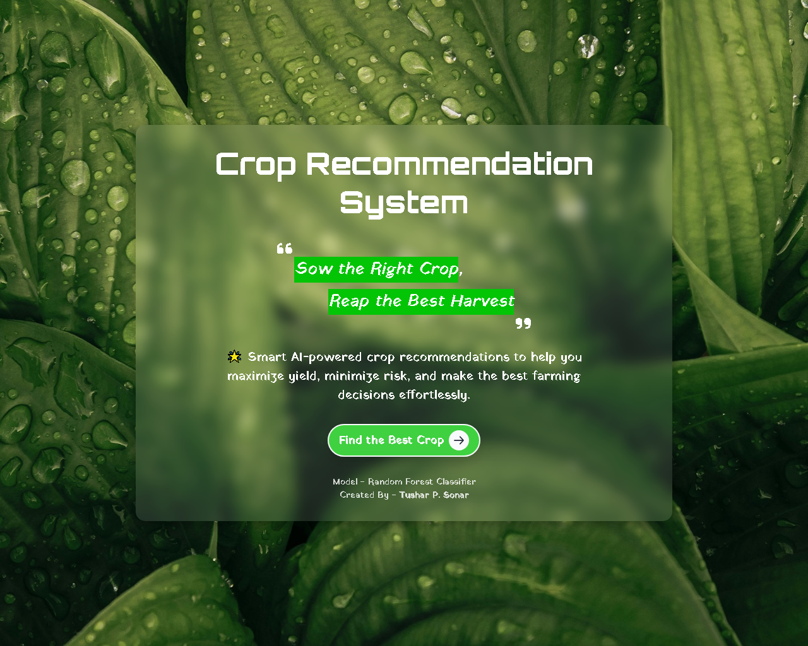
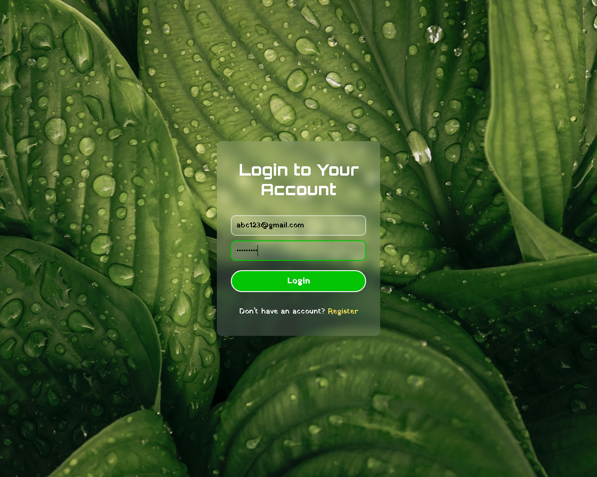
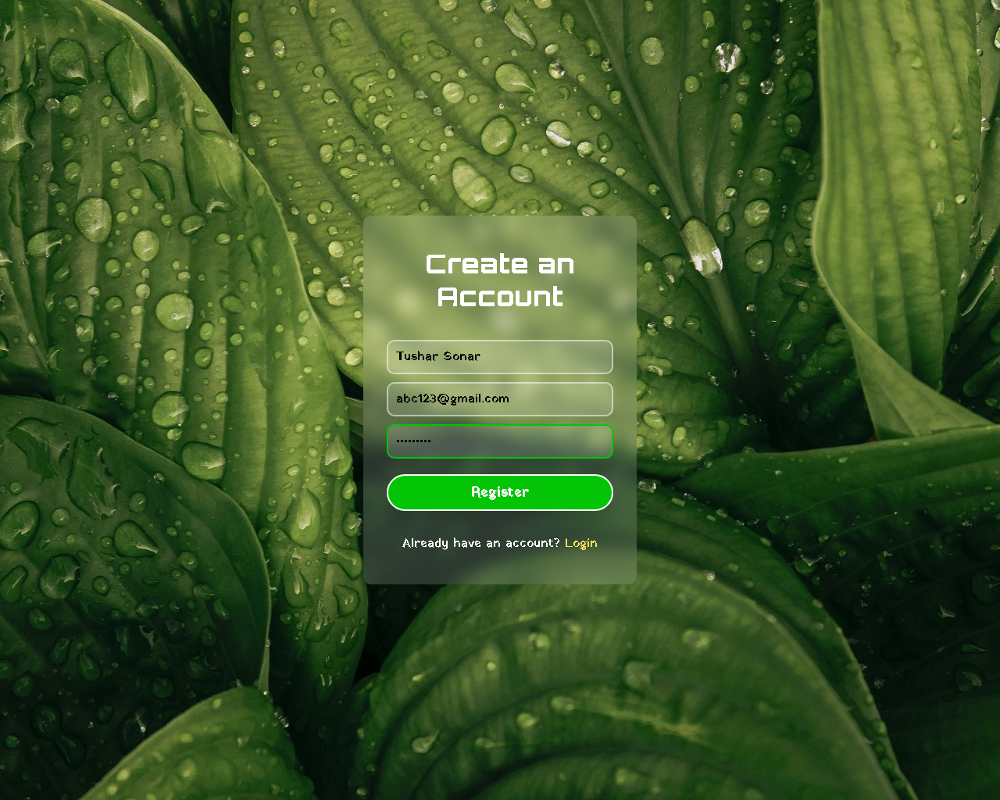
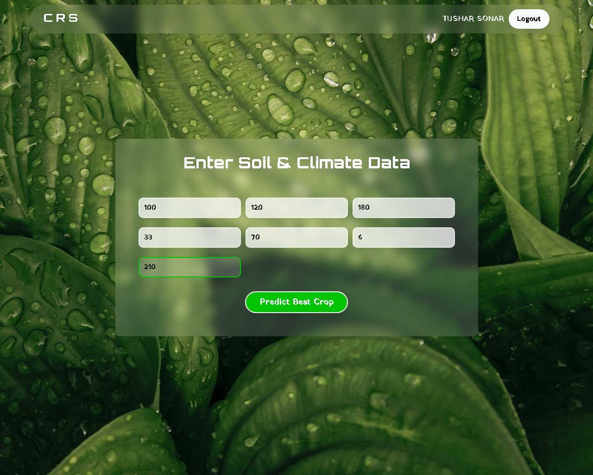
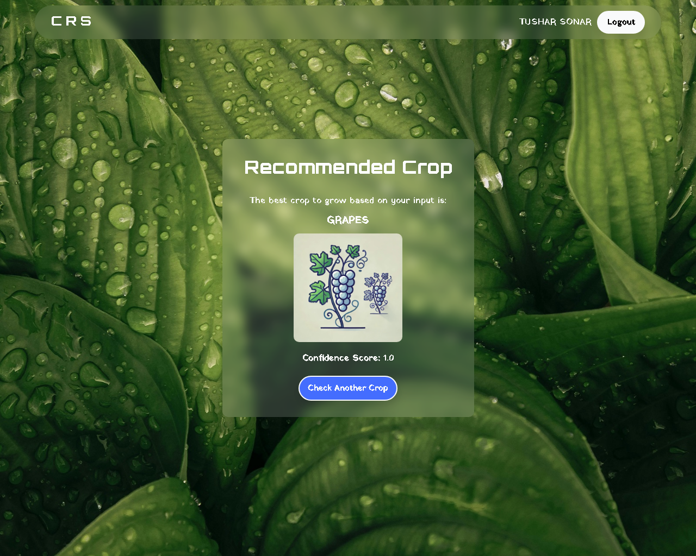

# 📄 Crop Recommendation System

## 📚 Project Overview

The **Crop Recommendation System** is a machine learning–powered web application designed to help farmers decide the most suitable crop to plant based on soil and environmental conditions.  
By analyzing parameters like **soil nutrients (N, P, K)**, **temperature**, **humidity**, **rainfall**, and **pH**, the system suggests the best crop to maximize yield and ensure sustainable farming practices.

---

## 🚀 Objectives

- Predict the most suitable crop using a trained **Random Forest Classifier**.
- Develop a **Flask-based web application** for farmer-friendly interaction.
- Promote **data-driven sustainable agriculture**.
- Enable easy deployment and accessibility via the web.

---

## 🔧 Technologies Used

- **Python 3.13** (for backend logic)
- **Flask** (web framework)
- **HTML, CSS, JavaScript** (frontend interface)
- **Scikit-learn, Pandas, NumPy** (machine learning libraries)
- **Matplotlib, Seaborn** (visualizations)
- **VS Code, Jupyter Notebook, Google Colab** (development tools)
- **Git & GitHub** (version control)

---

## 📊 Methodology

- **Data Collection:** Agricultural dataset containing soil and climate parameters.
- **Preprocessing:** Cleaning, scaling (MinMaxScaler), and exploratory data analysis (EDA).
- **Model Development:** Random Forest Classifier trained with hyperparameter tuning and cross-validation.
- **Deployment:** Flask-based web app hosting the trained model, user input form, and real-time predictions.
- **Evaluation:** Metrics such as Accuracy, Precision, Recall, F1-Score.

---

## 🛠️ Software and Hardware Requirements

### Software
- OS: Windows / Linux / MacOS
- Python 3.13
- Flask, HTML, CSS, JavaScript
- Scikit-learn, Pandas, NumPy, Matplotlib

### Hardware
- CPU: Intel Core i3 minimum (i5/i7 recommended)
- RAM: 4 GB minimum (8 GB recommended)
- Storage: 20 GB free space minimum
- Internet: Stable broadband connection

---

## 🔗 Database Design (ERD Overview)

The system database involves **four main tables**:

| Table Name        | Purpose                                                   |
|-------------------|------------------------------------------------------------|
| User              | Stores farmer's info: name, email, password.               |
| Soil Data         | Stores soil parameters linked to each user.                |
| Crop              | Stores details of various crops and suitable soil types.   |
| Recommendation    | Stores prediction results including confidence scores.     |

> Relationships:
> - A User submits multiple Soil Data records (One-to-Many).
> - Each Soil Data gets one Crop Recommendation (One-to-One).
> - Recommendations reference a Crop (Many-to-One).

---

## 🖼️ System Flow

- **User Inputs:** Soil NPK values, temperature, humidity, rainfall, and pH.
- **Backend Processing:** Input is preprocessed and passed to the trained ML model.
- **Prediction:** Model suggests the best crop with a confidence score.
- **Output:** Result displayed to the user via the web interface.

---

## 📈 Results and Performance

- **Accuracy Achieved:** ~99.31%
- **Key Features:** Nitrogen, Phosphorus, Potassium, Temperature, Humidity, pH, Rainfall.
- **Visual Tools:** Confusion Matrix, Feature Importance Graphs.

---

## 🖼️ Screenshots

### 🔹 Home Page


### 🔹 Login Page


### 🔹 Register Page


### 🔹 Prediction Form


### 🔹 Result Page


---

## 📖 References

- [GeeksforGeeks: Crop Recommendation System](https://www.geeksforgeeks.org/crop-recommendation-system-using-tensorflow/)
- [Kaggle: Crop Recommendation Dataset](https://www.kaggle.com/datasets/atharvaingle/crop-recommendation-dataset)
- [Flask Documentation](https://flask.palletsprojects.com/)
- [Scikit-learn Documentation](https://scikit-learn.org/stable/documentation.html)
- [Pandas Documentation](https://pandas.pydata.org/docs/)
- [NumPy Documentation](https://numpy.org/doc/)
- [Matplotlib Documentation](https://matplotlib.org/stable/contents.html)
- [Seaborn Documentation](https://seaborn.pydata.org/)

---

# ✅ Project Status
**Completed successfully and you can preview on Replit [🔗]([https://c78c8892-97b2-4181-a74f-46364953c395-00-1dbpna9jqxho3.worf.replit.dev/](https://replit.com/@3512Sonar/CropRecommendationSystem))**

---

# 📝 Setup 

This guide will help you set up and run the **Crop Recommendation System** on a new system (Windows + SQLite).

---

## 1. Prerequisites

### A. Install Python

* Download from: [https://www.python.org/downloads/](https://www.python.org/downloads/)
* During setup, **check** "Add Python to PATH"

### B. (Optional) Install Git

* Download: [https://git-scm.com/downloads](https://git-scm.com/downloads)

---

## 2. Download the Project

### A. Using Git:

```bash
git clone https://github.com/YourUsername/CropRecommendationSystem.git
cd CropRecommendationSystem
```

### B. Or Download ZIP:

* Extract to your desired location

---

## 3. Create a Virtual Environment (Optional)

```bash
python -m venv venv
venv\Scripts\activate  # Windows
```

---

## 4. Install Requirements

Ensure `requirements.txt` exists in your root folder. Then run:

```bash
pip install -r requirements.txt
```

If not available, manually install:

```bash
pip install flask flask_sqlalchemy flask_login pandas numpy scikit-learn
```

---

## 5. Project Structure

Make sure your folder looks like this:

```
CropRecommendationSystem/
├── app.py
├── models.py
├── crop_recommendation_model.pkl
├── crop_recommendation_scaler.pkl
├── requirements.txt
├── templates/
├── static/
│   ├── css/
│   └── images/crops/
└── instance/ (auto created)
```

---

## 6. Initialize the Database

Run:

```bash
python app.py
```

This will create `database.db` automatically.

Open browser:

```
http://127.0.0.1:5007/
```

---

## 7. View the Database (Optional)

* Install **DB Browser for SQLite**: [https://sqlitebrowser.org/](https://sqlitebrowser.org/)

---

## 8. Deployment Tips

* Don’t upload `venv/` or `.db` to GitHub
* Use `.gitignore` to exclude unwanted files
* Keep your `app.secret_key` secure

---

## Done!

You're now ready to run and test the Crop Recommendation System on any Windows machine!

